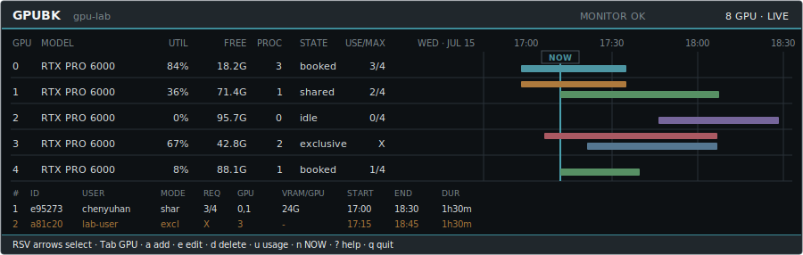

# GPUBK

**English** | [简体中文](https://github.com/lzzmm/GPUbk/blob/main/README.zh-CN.md)

<p align="center">
  
</p>

**GPU time, without spreadsheet time.**

GPUBK is a lightweight GPU reservation and usage tool for shared Linux servers.
Users book GPUs with the short `bk` command or an interactive terminal timeline;
administrators get atomic storage, access control, monitoring, and audit history.

[Install](#install) · [Everyday use](#everyday-use) ·
[Shared server](#shared-server) · [Multiple servers](#multiple-servers) ·
[Documentation](#documentation)

## Highlights

- Shared or exclusive reservations, automatic placement, and configurable time slots.
- Live GPU, process, memory, and utilization views without a web service.
- Container-aware attribution with explicit verified, inferred, or ambiguous ownership.
- Scheduled commands with automatic `CUDA_VISIBLE_DEVICES` selection.
- Local, versioned storage with atomic writes, backups, and UID-based authorization.
- CLI, curses TUI, JSON output, MCP tools, and multi-host expansion support.

GPUBK is a cooperative scheduler. Linux device permissions remain the final
enforcement boundary.

## Install

Python 3.10 or newer is required.

### Quick evaluation

Install into your own Python environment. This does not create system services or
change `/etc`:

```bash
python3 -m pip install 'gpubk[gpu]'
bk --version
bk tutorial
```

Try the scheduler without a GPU:

```bash
BK_DATA_DIR=/tmp/gpubk-demo BK_GPU_COUNT=4 bk t
```

### Shared server

For a shared GPU server, run this once as an administrator:

```bash
sudo python3 -m venv /opt/gpubk
sudo /opt/gpubk/bin/python -m pip install --upgrade pip
sudo /opt/gpubk/bin/python -m pip install 'gpubk[gpu]'
sudo /opt/gpubk/bin/bk admin install
bk doctor --probe --require-monitor --strict
```

The installer normally creates `/usr/local/bin/bk`. If that directory is not
root-owned, do not change its ownership: first verify `/usr/bin/bk` is absent,
then run `sudo /opt/gpubk/bin/bk admin install --command-path /usr/bin/bk`.

The guided installer creates the system command, data directories, and boot
services. Ordinary users run `bk` without `sudo` and cannot edit another UID's
reservations or administrator policy.

Successful deployment has two active services and a ready preflight:

```bash
sudo systemctl status gpubk-broker gpubk-monitor
bk doctor --probe --require-monitor --strict
```

## Everyday Use

```bash
bk                 # status and interactive prompt
bk 1 30m           # reserve one GPU for 30 minutes
bk 2 1h30m 12g     # two GPUs, 90 minutes, 12 GiB per GPU
bk x 1 2h           # exclusive reservation
bk a                # guided reservation
bk l                # list your reservations
bk g                # suggest a GPU available now
bk run -- python train.py
bk t                # visual terminal timeline
bk u                # your usage summary
```

Run `bk -h`, `bk help COMMAND`, or `bk tutorial` whenever you need guidance.

## Shared Server

The broker is the only writer of the protected ledger. The monitor samples NVML
telemetry, while CLI and TUI clients connect through a local Unix socket. Both
services start automatically after reboot. GPUBK does not create a Linux user or
group by default; the administrator who installs it owns the deployment.

Upgrade an existing installation without deleting policy or history:

```bash
sudo /opt/gpubk/bin/python -m pip install --upgrade 'gpubk[gpu]'
sudo /opt/gpubk/bin/bk admin install --yes
bk doctor --probe --require-monitor --strict
```

The installer preserves data and policy during upgrades. Preview destructive or
ownership-changing operations with `--dry-run` first.

### Uninstall a shared server

The administrative uninstall removes services, configuration, the global `bk`
link, and optionally all GPUBK data. The Python package lives inside
`/opt/gpubk`, not in the system `python3`, so remove that environment last:

```bash
sudo systemctl disable --now gpubk-monitor.service gpubk-broker.service
sudo /opt/gpubk/bin/bk admin services uninstall --yes
sudo /opt/gpubk/bin/bk admin uninstall --purge-data --yes
sudo rm -rf /opt/gpubk
hash -r
command -v bk || echo "GPUBK removed"
```

Use `sudo /opt/gpubk/bin/bk admin uninstall --dry-run --purge-data` first when
you want to inspect exactly what will be removed. Do not run `python3 -m pip
uninstall gpubk`: the system interpreter cannot see a package installed in
`/opt/gpubk`.

## Multiple Servers

Cluster mode federates independently safe GPUBK hosts. Every GPU server keeps its
own broker, ledger, monitor, and authority; the client compares hosts over
host-key-verified SSH and books exactly one host. No central database or new network
daemon is required, and a reservation never spans hosts.

1. Install and validate GPUBK normally on every GPU server.
2. Configure non-interactive SSH with verified host keys for participating users.
3. Build the root-owned client catalog and verify every route.

```bash
sudo bk admin cluster init gpu-a --yes
bk c probe gpu-b gpu-b
# Review and run the exact `sudo bk admin cluster add ...` command it prints.
bk c check
bk c rec 2 1h
bk c 2 1h
```

On a login node, omit `cluster init` and add each GPU host with `bk c probe`.
See [CLUSTER.md](docs/CLUSTER.md) before production use; it covers per-node identity,
UID mapping, failure behavior, NFS history export, and scheduled jobs.

## Documentation

- [Complete administrator and user guide](https://github.com/lzzmm/GPUbk/blob/main/docs/GUIDE.md)
- [Architecture rules](https://github.com/lzzmm/GPUbk/blob/main/docs/ARCHITECTURE.md)
- [中文完整手册](https://github.com/lzzmm/GPUbk/blob/main/docs/GUIDE.zh-CN.md)
- [Upgrading](docs/UPGRADING.md)
- [Security model](SECURITY.md)
- [Cluster deployment](docs/CLUSTER.md)
- [Telemetry format](docs/TELEMETRY.md)
- [Release process](docs/RELEASING.md)

Licensed under [Apache-2.0](LICENSE).
